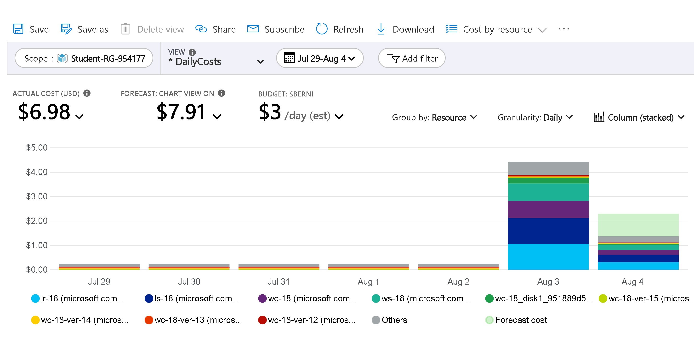
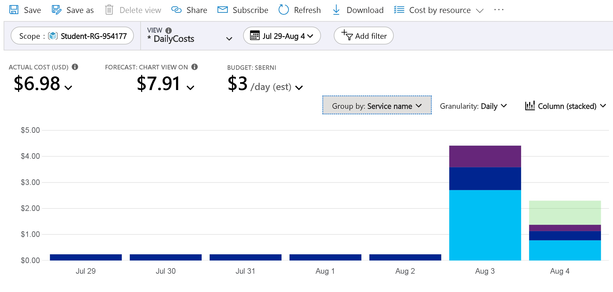
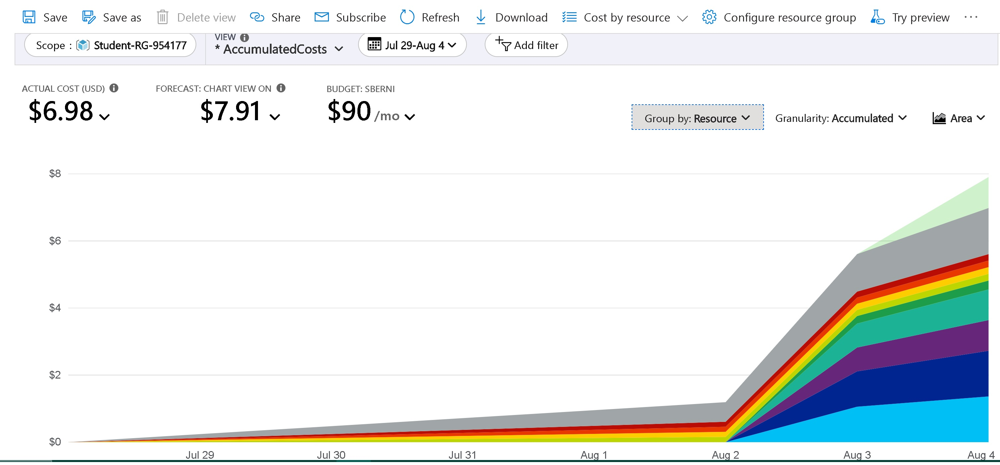
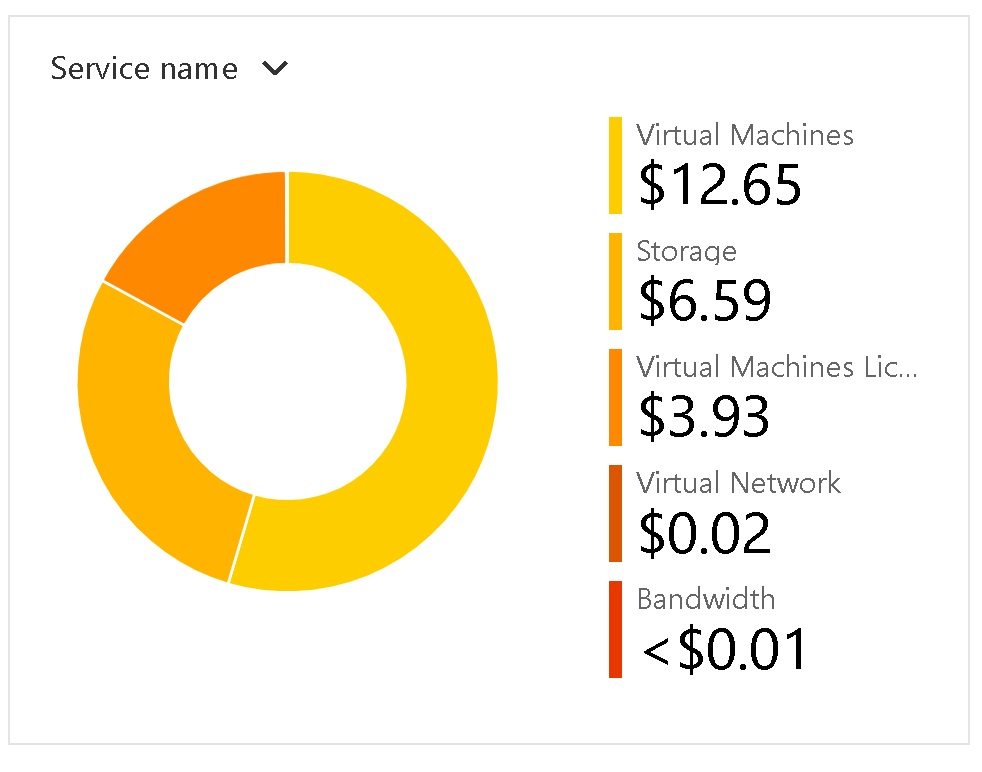
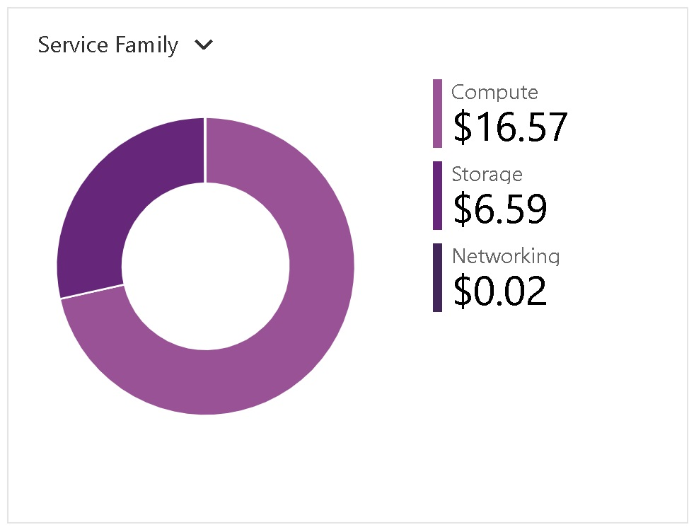
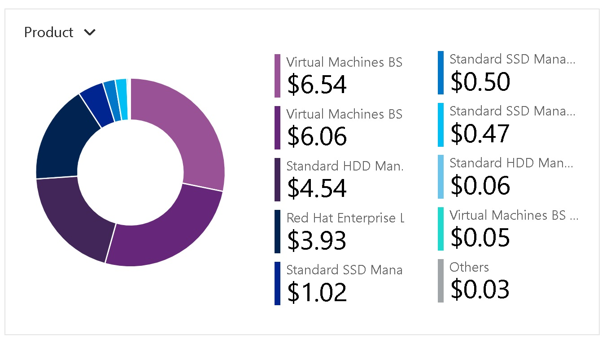

# Checkpoint10 Submission

- **COURSE INFORMATION: CSN400-2234**
- **STUDENT’S NAME: Soufiane Berni**
- **STUDENT'S NUMBER: 108170218**
- **GITHUB USER ID: 108170218-myseneca**
- **TEACHER’S NAME: Atoosa Nasiri**

### Table of Contents

- [Part A - Route Table Updates](#part-a---route-table-updates)
- [Part B - Port Forwarding Basic Connectivity](#part-b---port-forwarding-basic-connectivity)
- [Part C - Logging-And-Isolating Masqueraded Packets](#part-c---logging-and-isolating-masqueraded-packets)
- [Part D - Azure Cost Analysis Charts](#part-d---azure-cost-analysis-charts)


### Part A - Route Table Updates

1. The command that lists all `Route Tables`, `Routes`, and `Associated Subnets` are:

To list all `Route Tables` in a table format:

`az network route-table list --output table`
```bash
DisableBgpRoutePropagation    Location    Name      ProvisioningState    ResourceGroup      ResourceGuid
----------------------------  ----------  --------  -------------------  -----------------  ------------------------------------
False                         canadaeast  RT-18     Succeeded            Student-RG-954177  66402e65-6a78-4cf5-927c-63124ee3eda2
False                         canadaeast  RT-EX-18  Succeeded            Student-RG-954177  929f835a-b121-4882-a743-70b94db68593
```

2. To list all `Routes` for a specific Route Table:

`az network route-table route list --resource-group Student-RG-954177 --route-table-name RT-18 --output table`
```bash
AddressPrefix     HasBgpOverride    Name              NextHopIpAddress    NextHopType       ProvisioningState    ResourceGroup
----------------  ----------------  ----------------  ------------------  ----------------  -------------------  -----------------
172.17.18.32/27   False             Route-to-Server   192.168.18.36       VirtualAppliance  Succeeded            Student-RG-954177
10.9.215.0/24     False             Route-to-Desktop  192.168.18.36       VirtualAppliance  Succeeded            Student-RG-954177
192.168.23.32/27  False             External-Router   192.168.18.36       VirtualAppliance  Succeeded            Student-RG-954177
```

3. The output for the subnet "SN1" in the virtual network "Router-18" within the resource group "Student-RG-954177":

`az network vnet subnet list --resource-group "Student-RG-954177" --vnet-name "Router-18"`


```json
{
  "addressPrefix": "192.168.18.32/27",
  "delegations": [],
  "etag": "W/\"e439bdaa-ff3d-41d8-96f3-f24f337a3129\"",
  "id": "/subscriptions/bd627181-5ddb-4bb6-b03f-5297c3be4e1e/resourceGroups/Student-RG-954177/providers/Microsoft.Network/virtualNetworks/Router-18/subnets/SN1",
  "ipConfigurations": [
    {
      "id": "/subscriptions/bd627181-5ddb-4bb6-b03f-5297c3be4e1e/resourceGroups/Student-RG-954177/providers/Microsoft.Network/networkInterfaces/lr-18/ipConfigurations/ipconfig1",
      "resourceGroup": "Student-RG-954177"
    }
  ],
  "name": "SN1",
  "privateEndpointNetworkPolicies": "Disabled",
  "privateLinkServiceNetworkPolicies": "Enabled",
  "provisioningState": "Succeeded",
  "resourceGroup": "Student-RG-954177",
  "routeTable": {
    "id": "/subscriptions/bd627181-5ddb-4bb6-b03f-5297c3be4e1e/resourceGroups/Student-RG-954177/providers/Microsoft.Network/routeTables/RT-EX-18",
    "resourceGroup": "Student-RG-954177"
  },
  "type": "Microsoft.Network/virtualNetworks/subnets"
}
```
### Part B - Port Forwarding Basic Connectivity

1. [./logfiles/nat-basic.sh](./logfiles/nat-basic.sh)
```bash
# to flush NAT tables
iptables -t nat -F

# to allow other students to access APACHE server 
iptables -t nat -A PREROUTING -p tcp --dport 1818 -j DNAT --to-destination 172.17.18.37:80

# to allow other students to access MySQL server 
iptables -t nat -A PREROUTING -p tcp --dport 1618 -j DNAT --to-destination 172.17.18.37:3306

# to allow other students to access Linux server - SSH 
iptables -t nat -A PREROUTING -p tcp --dport 1218 -j DNAT --to-destination 172.17.18.37:22

# to allow other students to access IIS server 
iptables -t nat -A PREROUTING -p tcp --dport 1918 -j DNAT --to-destination 172.17.18.36:80

# to allow other students to access Windows server - RDP 
iptables -t nat -A PREROUTING -p tcp --dport 1318 -j DNAT --to-destination 172.17.18.36:3389

# to allow post routing
iptables -t nat -A POSTROUTING -o eth0 -j MASQUERADE
```
2. The `nat_basic-connectivity.sh` file that contains Basic Connectivity is:

[./logfiles/nat-basic-connectivity.sh](./logfiles/nat-basic-connectivity.sh)

```bash
# to flush NAT tables
iptables -t nat -F

# to allow other students to access APACHE server and log the packets
iptables -t nat -A PREROUTING -p tcp --dport 1818 -j LOG --log-prefix "DNAT_APACHE"
iptables -t nat -A PREROUTING -p tcp --dport 1818 -j DNAT --to-destination 172.17.18.37:80

# to allow other students to access MySQL server and log the packets
iptables -t nat -A PREROUTING -p tcp --dport 1618 -j LOG --log-prefix "DNAT_MYSQL: "
iptables -t nat -A PREROUTING -p tcp --dport 1618 -j DNAT --to-destination 172.17.18.37:3306

# to allow other students to access Linux server - SSH and log the packets
iptables -t nat -A PREROUTING -p tcp --dport 1218 -j LOG --log-prefix "DNAT_SSH: "
iptables -t nat -A PREROUTING -p tcp --dport 1218 -j DNAT --to-destination 172.17.18.37:22

# to allow other students to access IIS server and log the packets
iptables -t nat -A PREROUTING -p tcp --dport 1918 -j LOG --log-prefix "DNAT_IIS: "
iptables -t nat -A PREROUTING -p tcp --dport 1918 -j DNAT --to-destination 172.17.18.36:80

# to allow other students to access Windows server - RDP and log the packets
iptables -t nat -A PREROUTING -p tcp --dport 1318 -j LOG --log-prefix "DNAT_RDP: "
iptables -t nat -A PREROUTING -p tcp --dport 1318 -j DNAT --to-destination 172.17.18.36:3389

# to allow post routing
iptables -t nat -A POSTROUTING -o eth0 -j MASQUERADE

```
2. The script that allows the partner traffic to be routed and forwarded via `HUBVNET` is:

[./logfiles/firewalls-cp10.sh](./logfiles/firewalls-cp10.sh)


### Part C - Logging-And-Isolating Masqueraded Packets


1. The content of the file `masqueraded-logged.log`

[./logfiles/masqueraded-logged.log](./logfiles/masqueraded-logged.log)

```bash

# HTTP Hub on Windows Server 80
Aug  4 01:25:09 LR-18 kernel: TO_DROP_FORWARDIN=eth0 OUT=eth0 MAC=00:22:48:d5:61:6a:ac:3d:94:1b:f5:c4:08:00 SRC=192.168.23.36 DST=172.17.18.36 LEN=41 TOS=0x00 PREC=0x00 TTL=125 ID=183 DF PROTO=TCP SPT=61889 DPT=80 WINDOW=2050 RES=0x00 ACK URGP=0

# HTTP Hub on Linux Server 80
Aug  4 01:24:17 LR-18 kernel: TO_DROP_FORWARDIN=eth0 OUT=eth0 MAC=00:22:48:d5:61:6a:ac:3d:94:1b:f5:c4:08:00 SRC=192.168.23.36 DST=172.17.18.37 LEN=40 TOS=0x00 PREC=0x00 TTL=125 ID=163 DF PROTO=TCP SPT=61884 DPT=80 WINDOW=2050 RES=0x00 ACK URGP=0

# MySQL	Hub on Linux Server 3306
Aug  4 01:40:39 LR-18 kernel: TO_DROP_FORWARDIN=eth0 OUT=eth0 MAC=00:22:48:d5:61:6a:ac:3d:94:1b:f5:c4:08:00 SRC=192.168.23.36 DST=172.17.18.37 LEN=40 TOS=0x00 PREC=0x00 TTL=125 ID=799 DF PROTO=TCP SPT=61896 DPT=3306 WINDOW=0 RES=0x00 ACK RST URGP=0

# RDP Hub on Windows Server 3389
Aug  4 01:31:41 LR-18 kernel: TO_DROP_FORWARDIN=eth0 OUT=eth0 MAC=00:22:48:d5:61:6a:ac:3d:94:1b:f5:c4:08:00 SRC=192.168.23.36 DST=172.17.18.36 LEN=40 TOS=0x00 PREC=0x00 TTL=125 ID=786 DF PROTO=TCP SPT=61926 DPT=3389 WINDOW=2046 RES=0x00 ACK URGP=0

# SSH Hub on Linux Server 22
Aug  4 01:40:40 LR-18 kernel: TO_DROP_FORWARDIN=eth0 OUT=eth0 MAC=00:22:48:d5:61:6a:ac:3d:94:1b:f5:c4:08:00 SRC=192.168.23.36 DST=172.17.18.37 LEN=52
```

2. A screenshot that shows the content of `masqueraded-capture.pcap` packets


### Part D - Azure Cost Analysis Charts

| No. | Scope | Chart Type | VIEW Type |  Date Range | Group By | Granularity| Example |
|-|-|-|-|-|-|-|-|
|1|Student-RG-954177| Column (Stacked) | DailyCosts | Last 7 Days | Resource | Daily |  |
|2|Student-RG-954177| Column (Stacked) | DailyCosts | Last 7 Days | Service | Daily |  |
|3|Student-RG-954177| Area| AccumulatedCosts | Last 7 Days | Resource | Accumulated |  |
|4|Student-RG-954177| Pie Chart | NA | Last Month | Service Name | NA |  |
|5|Student-RG-954177| Pie Chart | NA | Last Month | Service Family | NA |  |
|6|Student-RG-954177| Pie Chart | NA | Last Month | Product | NA |  |

7. [./images/dashboard.jpg](./images/dashboard.jpg)


